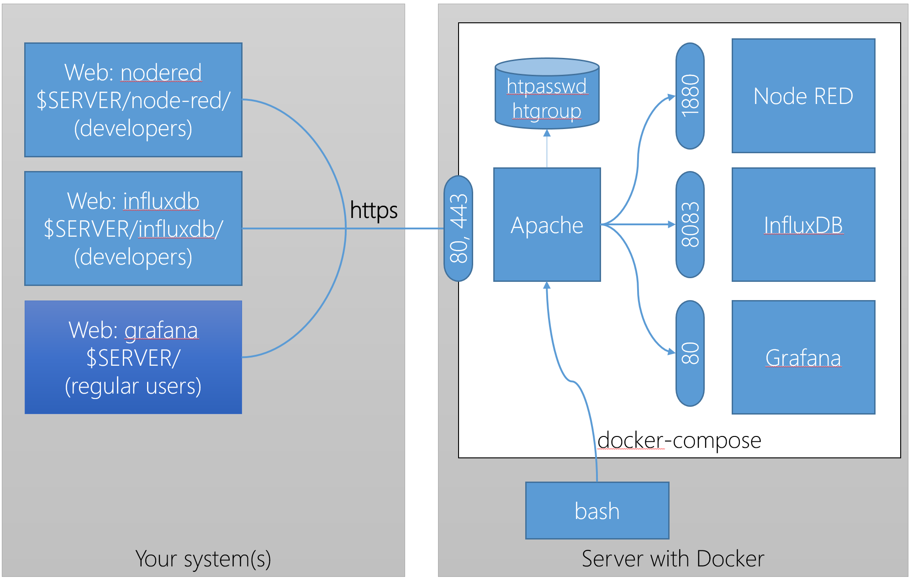

# Dashboard example for The Things Network

This repository contains a complete example that grabs device data from The Things Network, stores it in a database, and then displays the data using a web-based dashboard.

You can set this up on a "Ubuntu + Docker" VM from the Microsoft Azure store with minimal effort. You should set up this service to run all the time so as to capture the data from your devices; you then access the data at your convenience using a web browser.

This example uses [docker-compose](https://docs.docker.com/compose/overview/) to set up a pipeline of three [docker containers](https://www.docker.com):

1. An instance of [Node-RED](http://nodered.org/), which processes the data from the individual nodes, and puts it into the database.
2. An instance of [InfluxDB](https://www.influxdata.com/), which stores the data as time-series measurements with tags.
3. An instance of [Grafana](http://grafana.org/), which gives a web-based dashboard interface to the data.

## Security
This version uses fixed login keys, which you should edit prior to deploying. The keys are in the files `ingressdb/.env` and `grafana/.env`.

This version does **not** natively provide HTTPS for securing access to the various services.

Microsoft Azure, by default, will not open any of the ports to the outside world, so the above two items are not a concern until you open the ports.

Rather than opening ports on Azure, we suggest you use SSH and proxy the ports:
```sh
ssh -L10080:localhost:80 -L11880:localhost:1880 -L180:localhost:8083 -L18086:localhost:8086 user@myhost.example.net
```
Then use port addresses when opening the remote service in your browser, specificaly:

To access | Open this link
----------|---------------
Node-RED | [http://localhost:11800](http://localhost:11800)
IngressDB administrative page | [http://localhost:18083](http://localhost:18083)
Grafana | [http://localhost:10080](http://localhost:10080)

This can be visualized as below:


## Assumptions

* You must have docker-compose 1.9 or later (for which see https://github.com/docker-compose -- be aware that apt-get normally doesn't grab this; if configured at all, it frequently gets an out-of-date version).
* `/var/lib/node-red` will have your local Node-RED data.
* `/var/lib/influxdb` will have your local influxdb data (this is what you should back up)
* `/var/lib/grafana` will have your dashboards

## Composition and External Ports

* Node-RED runs on port 1880.
* Grafana runs on port 80.
* InfluxDB runs on port 8086 and is linked as host name **influxdb** (without a domain name; this is used when connecting from the other two docker images, so as to keep the traffic internal to the node).
* In addition InfluxDB exports an administrative web interface on port 8083.

## Installation

1. Define root URL and passwords in `grafana/.env` and `influxdb/.env`
2. `% docker-compose build`
3. `% docker-compose up`
4. Open Node-RED on **http://machine.example.net:1880** (or, if using the above SSH mappings, **[http://localhost:11880](http://localhost:11880)**) and build a flow that stores data in InfluxDB
5. Open Grafana on **http://machine.example.net** (or, if using the above SSH mappings, **[http://localhost:10080](http://localhost:10080)**), and build a dashboard that retrieves data from InfluxDB

## Data Files

Datafiles are kept in the following locations by default.

Component | Data file location
----------|-------------------
Node-RED | `/var/log/node-red`
InfluxDB | `/var/log/influxdb`
Grafana | `/var/log/grafana`

You can store these data files in a different location by setting the environment variable `TTN_DASHBOARD_DATA` to the **absolute path** to the containing direcotry. The above paths are appended to the value of `TTN_DASHBOARD_DATA`. Directories are created as needed. For example:
```sh
export TTN_DASHBOARD_DATA=/dashboard-data
docker-compose up -d
```
In this case, the data files are created in the following locations:

Component | Data file location
----------|-------------------
Node-RED | `/dashboard-data/var/log/node-red`
InfluxDB | `/dashboard-data/var/log/influxdb`
Grafana | `/dashboard-data/var/log/grafana`

Data files left in these locations will be resued.

## Examples

Node-RED installs with several example flows that reads data from test nodes and stores the data in InfluxDB. Import the example from Menu > Import > Library, and then edit both the TTN connection (on the left) and the InfluxDB connection (on the right).

This version requires that you set up the database and the grafana dashboards manually, but we hope to add a reasonable set of initial files in the next release.

## Acknowledgements
This builds on work done by Johan Stokking of [The Things Network](www.thethingsnetwork.org) for the staging environment. Additional adaptation done by Terry Moore of [MCCI](www.mcci.com).

